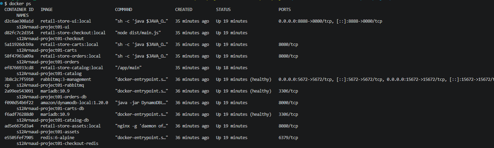
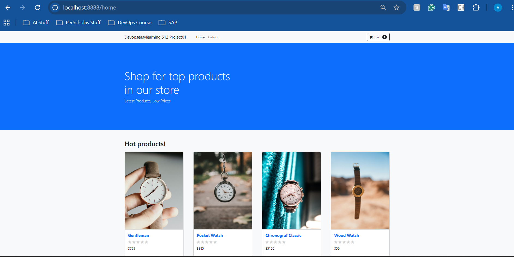
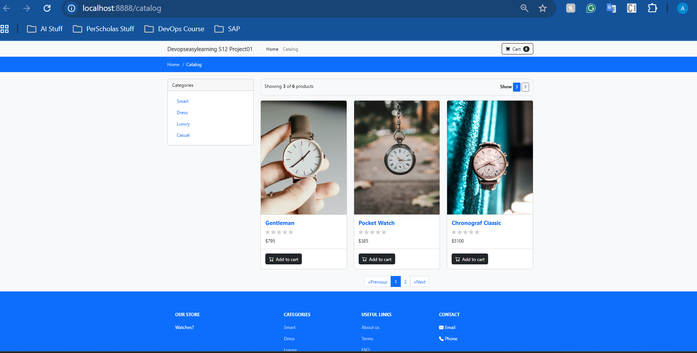

# 🛒 Retail Store — Full Microservices Deployment

**Arlex Kombo Kaya | Cloud & DevOps Engineer | github.com/arlex-dev**

---

## 📋 Overview

Full deployment of a microservices-based retail store application
using Docker Compose. Orchestrated 11 services across multiple
languages and runtimes — Java, Go, Node.js, and Nginx — with
MariaDB, DynamoDB Local, Redis, and RabbitMQ as backing services.

---

## 🏗️ Architecture

~~~
Browser (localhost:8888)
         ↓
    ui (Java Spring Boot)
         ↓
  ┌──────┬──────┬────────┬─────────┬────────┐
catalog  carts  orders  checkout  assets
 (Go)   (Java) (Java)  (Node.js) (Nginx)
  │       │       │        │
catalog  carts  orders  checkout
  -db     -db    -db      -redis
(MariaDB)(DynamoDB)(MariaDB)(Redis)
                   │
               rabbitmq
              (RabbitMQ)
~~~

---

## 🛠️ Tech Stack

| Service | Technology | Purpose |
|---|---|---|
| ui | Java 17 / Spring Boot | Web frontend & API aggregator |
| catalog | Go | Product catalog API |
| carts | Java 17 / Spring Boot | Shopping cart API |
| orders | Java 17 / Spring Boot | Orders API |
| checkout | Node.js / NestJS | Checkout orchestration |
| assets | Nginx | Static files |
| catalog-db | MariaDB | Catalog database |
| orders-db | MariaDB | Orders database |
| carts-db | DynamoDB Local | Cart database |
| checkout-redis | Redis | Session store |
| rabbitmq | RabbitMQ | Orders messaging broker |

---

## 📁 Project Structure

~~~
retail-store-microservices/
│
├── src/
│   ├── ui/           # Java Spring Boot frontend
│   ├── catalog/      # Go catalog API
│   ├── cart/         # Java Spring Boot cart service
│   ├── orders/       # Java Spring Boot orders service
│   ├── checkout/     # Node.js checkout service
│   └── assets/       # Nginx static assets
│
├── images/
│   ├── java17/       # Reusable Java 17 Dockerfile
│   ├── go/           # Reusable Go Dockerfile
│   └── nodejs/       # Reusable Node.js Dockerfile
│
├── Screenshots/      # Deployment evidence
├── docker-compose.yml
├── .env.example
└── README.md
~~~

---

## ⚙️ Environment Setup

Create a `.env` file in the project root:

~~~bash
MYSQL_PASSWORD=your-local-password
~~~

The `.env` file is excluded from Git via `.gitignore`.

---

## 🚀 How to Deploy

~~~bash
# 1. Clone the repo
git clone https://github.com/arlex-dev/retail-store-microservices.git
cd retail-store-microservices

# 2. Create .env file
echo "MYSQL_PASSWORD=store-local-pass" > .env

# 3. Build all images from source
docker compose build

# 4. Start all 11 services
docker compose up -d

# 5. Verify all services are running
docker compose ps
~~~

---

## 🌐 Access the Application

~~~bash
# Open in browser
http://localhost:8888

# Test endpoints
curl -L http://localhost:8888/
curl -L http://localhost:8888/catalog
curl -L http://localhost:8888/cart

# RabbitMQ Management UI
http://localhost:15672
# credentials: guest / guest
~~~

---

## 📊 Screenshots

### All 11 containers running

### Store Homepage

### Catalog Page

### RabbitMQ Management UI

---

## 🔍 Useful Commands

~~~bash
# View logs for all services
docker compose logs -f

# View logs for specific service
docker compose logs -f catalog
docker compose logs -f orders

# Stop all containers
docker compose stop

# Stop and remove everything including volumes
docker compose down -v
~~~

---

## 🔑 Key DevOps Skills Demonstrated

- Docker Compose authoring for 11 interconnected services
- Multi-language service orchestration (Java, Go, Node.js, Nginx)
- Service dependencies and health checks configuration
- Internal service networking between containers
- Environment variable management with .env files
- Message broker integration with RabbitMQ
- Database containerization (MariaDB, DynamoDB Local, Redis)
- Container troubleshooting with logs and compose ps

---

## 👤 Author
Arlex Kombo Kaya — github.com/arlex-dev

## 📝 Project Context
Application source code and Dockerfiles provided by DEL-ORG
DevOps bootcamp. The docker-compose.yml was authored by
Arlex Kombo Kaya — connecting all 11 services, defining
dependencies, health checks, environment variables, and
networking across Java, Go, Node.js, Nginx, MariaDB,
DynamoDB, Redis and RabbitMQ containers.
